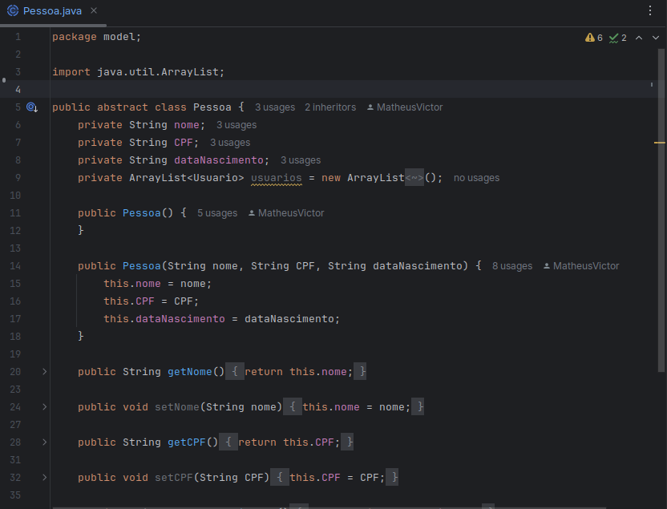
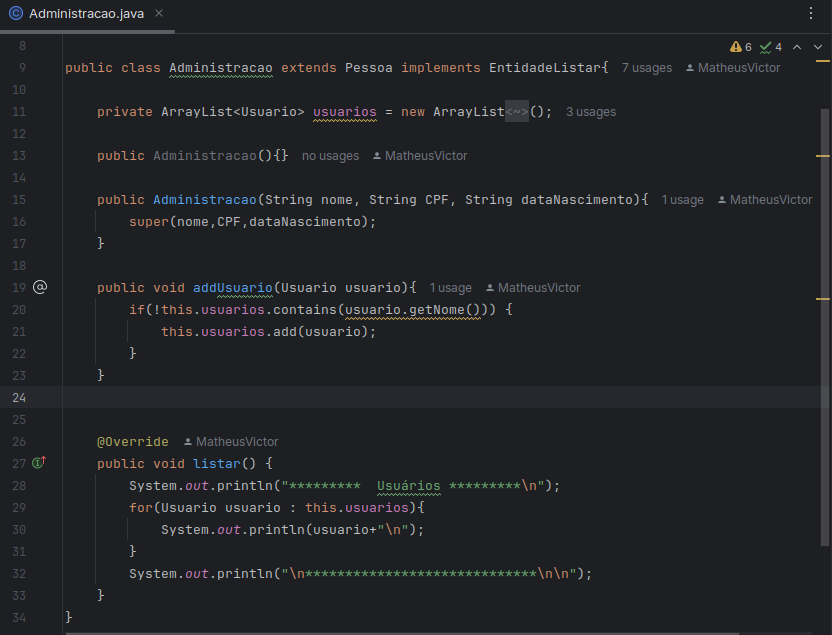
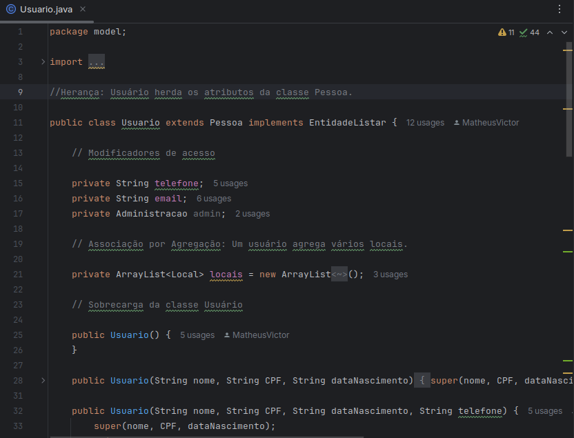
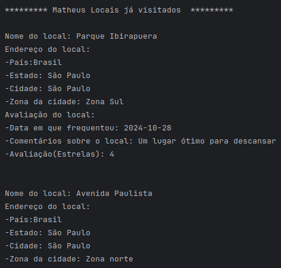
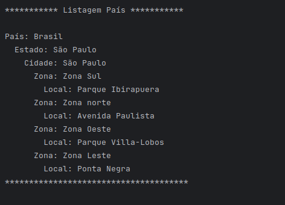
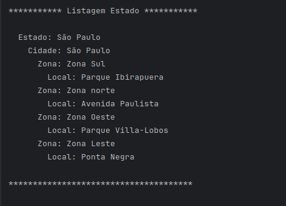
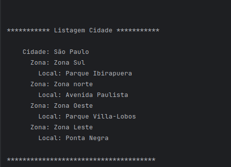
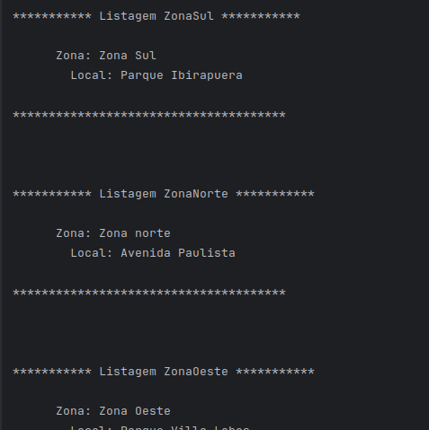

# 🏞️ MyTryps

> 🚀 **Projeto final do curso Java POO Aranouá** – um sistema de gerenciamento de locais visitados.

## 📌 Sobre o Projeto

O **MyTryps** é um sistema desenvolvido em **Java** que permite aos usuários cadastrar e gerenciar locais visitados. A plataforma possibilita visualizar avaliações dos locais, além de aplicar filtros por **países, estados, cidades** e até mesmo **zonas da cidade**.

## 🚀 Tecnologias Utilizadas

- **Java**

## 🎯 Funcionalidades

✅ Cadastro de locais visitados\
✅ Avaliação de locais\
✅ Filtros avançados (país, estado, cidade, zona)\
✅ Organização intuitiva dos locais visitados

## 🛠️ Aprendizados

Durante o desenvolvimento do **MyTryps**, aprofundei meu conhecimento nos **pilares da Programação Orientada a Objetos (POO)**, aplicando conceitos fundamentais como:

- **Herança**
- **Polimorfismo** (sobrescrita e sobrecarga)
- **Interfaces**
- **Associação Simples**
- **Associação por Agregação**
- **Composição entre classes**

## 📸 Imagens do Projeto

**Classe Abtrata Pessoa**


**Classe Admin**


**Classe Usuário**


**Locais visitados por um usuário**


**Filtro por países já visitados**


**Filtro por Estados já visitados**


**Filtro por Cidades já visitadas**


**Filtro por Zonas já visitadas**


## 📌 Como Executar o Projeto

1️⃣ Clone este repositório:

```sh
 git clone https://github.com/seu-usuario/MyTryps.git
```

2️⃣ Importe o projeto em sua IDE de preferência (**Eclipse**, **IntelliJ**, etc.)

3️⃣ Execute o arquivo principal da aplicação.

---

🚀 *Desenvolvido por Matheus Victor*

